<h1 align="center">Rodrigo Henriky</h1><!--

<p align="center"><i>Engenheiro de Computação | Desenvolvedor Full-Stack | Entusiasta de Tecnologias Emergentes</i></p>🐍 RODRIGO HENRIKY - SNAKE DEVELOPER 🐍

Transformando ideias em código, um pixel por vez!

<p align="center" display="inline-block">-->

  

  <div align="center">

  <a href="https://www.codacy.com/gh/rhenriky/rhenriky/dashboard?utm_source=github.com&amp;utm_medium=referral&amp;utm_content=rhenriky/rhenriky&amp;utm_campaign=Badge_Grade"></a>

  <!-- Animated Header with Snake Theme -->

  <a href="https://github.com/rhenriky/rhenriky/commits/main">

    

  </a><!-- Snake-themed Typing Effect -->

  <a href="https://github.com/rhenriky/rhenriky/issues">

    

  </a></div>

  

</p><!-- Snake Separator -->


---

## 🐍 **Meu Snake Game - Jogue Agora!**

## 📊 Estatísticas do GitHub

<div align="center">


**[🎮 JOGAR SNAKE GAME](https://github.com/rhenriky/JogodaCobra)** | **[📱 Download](https://github.com/rhenriky/JogodaCobra/releases)**

---

*Desenvolvido 100% em Rust 🦀 - Com velocidade progressiva e obstáculos!*

## 🛠️ Tecnologias e Habilidades


### 💻 Linguagens de Programação</div>

<p display="inline-block">

  ---

  

  <!-- Snake-themed Stats -->

  <div align="center">

  

  ## 📊 **Stats da Cobra** *(Como uma cobra, sempre crescendo!)*

  

  

  

  

</p></div>


### 🛠️ Ferramentas e Frameworks<!-- Snake Contribution Graph -->

<p display="inline-block"><div align="center">

  

  

  **🐍 Como uma cobra, meus commits crescem continuamente!**

  </div>

  

  ---

  

</p>## 🛠️ **Arsenal da Cobra** *(Ferramentas que uso para "engolir" problemas)*


---<div align="center">


## 🚀 Projetos Destacados### 🐍 **Linguagem Principal - Rust** 


### 🐍 Snake Game em Rust

- Desenvolvido em **Rust** com interface de terminal.

- Velocidade progressiva que aumenta a cada maçã consumida.

- Obstáculos aleatórios para maior desafio.

- Sistema de restart e paredes sólidas.### 💻 **Stack Principal**


### 📋 Sistema de Gerenciamento de Tarefas

- Desenvolvido em **Flutter** e **Python**.

- Aplicativo móvel para organização de tarefas com sincronização em nuvem.


### 🤖 Automação de Processos com Python

- Scripts para automação de tarefas repetitivas em ambientes corporativos.### 🚀 **Frameworks & Tools**


### 🮠Jogo em C++

- Jogo de estratégia em tempo real desenvolvido como projeto acadêmico.


### 🌐 Site Pessoal

- Desenvolvido com **HTML**, **CSS** e **JavaScript** para exibir portfólio e habilidades.</div>


------


## 📚 Formação Acadêmica## 🐍 **Projetos da Cobra** *(Cada um mais desafiador que o anterior!)*


- **🎓 Engenharia de Computação**<table>

  IFMT (Instituto Federal de Mato Grosso) - Conclusão em Andamento<tr>

<td width="50%">

---

### 🐍 **Snake Game Engine - Rust** 

## 📫 Contato


Fique à vontade para entrar em contato comigo:

**O jogo da cobra mais avançado que você já viu!**

- **🔗 LinkedIn**: [Rodrigo Henriky](https://www.linkedin.com/in/rodrigo-henriky/)- ⚡ **Velocidade progressiva** - fica mais rápido!

- **🙋 GitHub**: [rhenriky](https://github.com/rhenriky)- 📦 **Obstáculos aleatórios** - evite as caixas!

- **📧 E-mail**: [RHenriky@protonmail.com](mailto:RHenriky@protonmail.com)- 🧱 **Paredes sólidas** - sem atravessar bordas!

- 🔄 **Sistema restart** - pressione R e jogue novamente!

---- 🎨 **Interface colorida** - visual moderno no terminal


## 🌟 Curiosidades```rust

// A filosofia da cobra

- **🧩 Apaixonado por resolver problemas complexos com código.**fn snake_wisdom() -> &'static str {

- **🚀 Entusiasta de tecnologias emergentes, como Rust e Flutter.**    "Cresça devagar, mas nunca pare!"

- **📚 Sempre em busca de novos desafios e aprendizados.**}

```

---

</td>

✨ **Vamos construir algo incrível juntos!** ✨<td width="50%">

### 🤖 **Portfolio Projects**


**Outros projetos importantes:**
- 📱 **App Flutter** - Gerenciamento de tarefas
- 🐍 **Scripts Python** - Automação empresarial  
- 🌐 **Sites Web** - Portfolio e landing pages
- 🛠️ **Ferramentas CLI** - Utilitários em Rust

```python
# Como uma cobra Python
def grow_skills():
    while True:
        learn_new_tech()
        build_projects()
        share_knowledge()
```

</td>
</tr>
</table>

---

## 🏆 **Conquistas da Cobra** *(Níveis desbloqueados!)*

<div align="center">

| 🐍 **Nível** | 🎯 **Conquista** | 📊 **Progresso** |
|---|---|---|
| 🦀 **Rust Master** | Dominar system programming |  |
| 🐍 **Snake Developer** | Criar jogos incríveis |  |
| ⭠**Open Source** | Contribuições públicas |  |
| 🚀 **Performance** | Código ultra-rápido |  |

</div>

---

## 📈 **Roadmap da Cobra 2024-2025**

```mermaid
graph TD
    A[🐍 Snake Game] --> B[🕸️ Web Assembly]
    B --> C[🤖 AI Integration]
    C --> D[🌐 Multiplayer Online]
    D --> E[📱 Mobile Version]
    E --> F[🎮 Game Engine]
    
    style A fill:#DC2626,stroke:#3B82F6,color:#fff
    style B fill:#3B82F6,stroke:#DC2626,color:#fff
    style C fill:#DC2626,stroke:#3B82F6,color:#fff
    style D fill:#3B82F6,stroke:#DC2626,color:#fff
    style E fill:#DC2626,stroke:#3B82F6,color:#fff
    style F fill:#3B82F6,stroke:#DC2626,color:#fff
```



---

## 🎵 **Soundtrack da Cobra** *(Música para codar)*

<div align="center">

[](https://open.spotify.com/user/rodrigohenriky)

*🎧 Lo-fi Hip Hop • Synthwave • Game Music*


</div>

---

## 🐍 **Snake Secrets** *(Para desenvolvedores curiosos)*

<details>
<summary>🔍 Clique para revelar os segredos da cobra...</summary>

### 🎮 **Comandos Secretos do Snake Game**
```bash
# Easter eggs no jogo
# Pressione durante o jogo:
# K - Modo Kamikaze (velocidade máxima)
# G - God Mode (atravessa obstáculos) 
# R - Restart
# Q - Quit
```

### 🐍 **Snake Code Poetry**
```rust
struct Snake {
    body: Vec<Position>,
    wisdom: &'static str,
}

impl Snake {
    fn philosophy(&self) -> &str {
        "Uma cobra não olha para trás,
         apenas cresce em direção ao futuro 🐍"
    }
}
```

### 📊 **Stats Secretas**
- 🐍 **Cobras criadas:** 42
- ☕ **Café para codar:** 1.337 xícaras
- 🎯 **Bugs eliminados:** 999+
- 🚀 **Commits da cobra:** ∞

</details>

---

## 🤝 **Conecte-se com a Cobra**

<div align="center">

<a href="https://linkedin.com/in/rodrigo-henriky">

</a>

<a href="mailto:RHenriky@protonmail.com">

</a>

<a href="https://github.com/rhenriky/JogodaCobra">

</a>

<a href="https://rhenriky.dev">

</a>

</div>

---

## 🐍 **Snake.Philosophy()** 

<div align="center">

```rust
impl SnakeDeveloper for RodrigoHenriky {
    fn core_beliefs(&self) -> Vec<&str> {
        vec![
            "🐍 Como uma cobra: crescer continuamente",
            "🎯 Foco no objetivo, como cobra caçando",  
            "⚡ Performance é fundamental",
            "🔧 Código limpo e elegante",
            "🌱 Sempre aprendendo, sempre evoluindo"
        ]
    }
    
    fn current_state(&self) -> State {
        State::Coding { 
            project: "Next Snake Innovation",
            energy: Maximum,
            coffee_level: Critical 
        }
    }
}
```

</div>

---

<!-- Snake Footer -->
<div align="center">


### 🐍 **"Como uma cobra, transformo desafios em crescimento"** 🐍


**🔥 Obrigado por visitar o universo da cobra! 🔥**

*Uma cobra não anda para trás, apenas cresce! 🚀*

</div>
