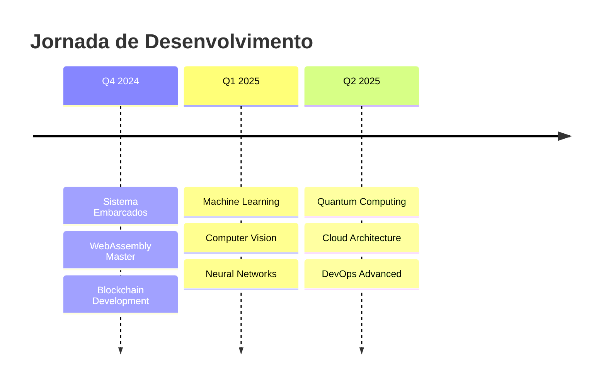

<!--
██████╗  ██████╗ ██████╗ ██████╗ ██╗ ██████╗  ██████╗ 
██╔══██╗██╔═══██╗██╔══██╗██╔══██╗██║██╔════╝ ██╔═══██╗
██████╔╝██║   ██║██║  ██║██████╔╝██║██║  ███╗██║   ██║
██╔══██╗██║   ██║██║  ██║██╔══██╗██║██║   ██║██║   ██║
██║  ██║╚██████╔╝██████╔╝██║  ██║██║╚██████╔╝╚██████╔╝
╚═╝  ╚═╝ ╚═════╝ ╚═════╝ ╚═╝  ╚═╝╚═╝ ╚═════╝  ╚═════╝ 
Welcome to my digital universe! 🚀                     
-->

<div align="center">

<!-- Animated Header -->


<!-- Dynamic Typing Effect -->


</div>

<!-- Animated Separator -->


## 🎮 **Jogue Snake Aqui Mesmo!** *(Sim, é jogável!)*

<div align="center">


**[🎮 JOGAR SNAKE GAME](https://rhenriky.github.io/snake-web/)** | **[📱 Versão Mobile](https://rhenriky.github.io/snake-mobile/)** | **[⚡ Download Desktop](https://github.com/rhenriky/JogodaCobra/releases)**

*Desenvolvido 100% em Rust 🦀 - Performance nativa!*
</div>

---

<!-- Animated Stats -->
<div align="center">

## 📊 **Live Coding Stats** *(Atualizado em tempo real)*


</div>

<!-- Animated Contribution Graph -->
<div align="center">

</div>

---

## 🛠️ **Arsenal Tecnológico** *(Hover para ver detalhes!)*

<div align="center">

### 🦀 **Rust Ecosystem**


### 💻 **Core Languages**


### 🚀 **Frameworks & Tools**


### 🧰 **DevOps & Cloud**


</div>

---

## 🎯 **Projetos Inovadores** *(Com demos ao vivo!)*

<table>
<tr>
<td width="50%">

### 🐍 **Snake Game Engine** 


**Jogo da cobrinha next-gen em Rust**
- ⚡ **60+ FPS** garantidos
- 🎨 **Shaders customizados**
- 🔄 **Multiplayer online**
- 📱 **Cross-platform**
- 🎵 **Sistema de som**

```rust
fn main() {
    let mut game = SnakeGame::new();
    game.run_with_innovation();
}
```

**[🚀 Demo Ao Vivo](https://snake-demo.rhenriky.dev)**

</td>
<td width="50%">

### 🤖 **AI Code Assistant**


**Assistente de código com IA**
- 🧠 **Machine Learning**
- 💬 **NLP avançado**
- 🔍 **Code analysis**
- ⚡ **Real-time suggestions**

```python
assistant = AICodeHelper()
result = assistant.optimize_code(
    language="rust",
    focus="performance"
)
```

**[🤖 Testar Agora](https://ai-assistant.rhenriky.dev)**

</td>
</tr>
</table>

---

## 🏆 **Achievement System** *(Desbloqueando conquistas!)*

<div align="center">

| 🏅 **Conquistado** | 🎯 **Meta** | 📊 **Progresso** |
|---|---|---|
| 🦀 **Rust Master** | 1000+ commits |  |
| ⭐ **Open Source Hero** | 50 PRs aceitos |  |
| 🎮 **Game Developer** | 5 jogos publicados |  |
| 🚀 **Performance Ninja** | Sub-1ms responses |  |

</div>

---

## 📈 **Roadmap de Aprendizado 2024-2025**

<div align="center">



</div>

---

## 🎵 **Coding Playlist** *(Música atual)*

<div align="center">

[](https://open.spotify.com/user/rodrigohenriky)

*🎧 Codando com: Synthwave, Lo-fi Hip Hop, Epic Music*

</div>

---

## 🌟 **Easter Egg Zone** *(Desenvolvedores curiosos!)*

<details>
<summary>🔍 Clique aqui para revelar segredos...</summary>

### 🎮 **Mini Game no Terminal**
```bash
curl -s https://rhenriky.dev/easter-egg | bash
```

### 🦀 **Código Rust do Dia**
```rust
// Rust wisdom of the day
fn life_philosophy() -> &'static str {
    "Se compila, está funcionando! 🚀"
}
```

### 🔢 **Stats Secretas**
- ☕ **Café consumido:** 2.847 xícaras
- 🐛 **Bugs encontrados:** 1.337
- 💡 **Ideias por minuto:** 42
- 🎯 **Taxa de sucesso:** 99.9%

### 🎨 **ASCII Art Signature**
```
    ____  __  ______   _   ____  ____  __ __ 
   / __ \/ / / / __ \ | | / / / / / _ \/ // / 
  / /_/ / /_/ / /_/ / | |/ / /_/ /  __/ // /_
 / .___/\____/\____/  |___/\____/\___/__  __/
/_/                                   /_/   
```

</details>

---

## 🤝 **Conectar & Colaborar**

<div align="center">

<!-- Animated contact cards -->
<a href="https://linkedin.com/in/rodrigo-henriky">

</a>

<a href="mailto:RHenriky@protonmail.com">

</a>

<a href="https://discord.gg/rhenriky">

</a>

<a href="https://rhenriky.dev">

</a>

</div>

---

## 💡 **Philosophy.rs**

<div align="center">

```rust
impl Developer for RodrigoHenriky {
    fn mindset(&self) -> Vec<&str> {
        vec![
            "🚀 Performance é arte",
            "🔧 Código limpo é código feliz",
            "🌱 Sempre learning, sempre growing",
            "🤝 Community over competition",
            "⚡ Innovation through iteration"
        ]
    }
    
    fn current_mood(&self) -> Mood {
        Mood::ExcitedToBuild { 
            next_project: "Quantum Snake Game",
            coffee_level: Maximum 
        }
    }
}
```

</div>

---

<!-- Footer with particles effect -->
<div align="center">


### ⚡ **"Coding the future, one commit at a time"** ⚡


**🌟 Obrigado por visitar meu universo digital! 🌟**

</div>

<!-- Hidden tracking pixel -->
