<!--
🐍 RODRIGO HENRIKY - SNAKE DEVELOPER 🐍
Transformando ideias em código, um pixel por vez!
-->

<div align="center">

<!-- Animated Header with Snake Theme -->


<!-- Snake-themed Typing Effect -->


</div>

<!-- Snake Separator -->


## 🐍 **Meu Snake Game - Jogue Agora!**

<div align="center">


**[🎮 JOGAR SNAKE GAME](https://github.com/rhenriky/JogodaCobra)** | **[📱 Download](https://github.com/rhenriky/JogodaCobra/releases)**

*Desenvolvido 100% em Rust 🦀 - Com velocidade progressiva e obstáculos!*


</div>

---

<!-- Snake-themed Stats -->
<div align="center">

## 📊 **Stats da Cobra** *(Como uma cobra, sempre crescendo!)*


</div>

<!-- Snake Contribution Graph -->
<div align="center">


**🐍 Como uma cobra, meus commits crescem continuamente!**
</div>

---

## 🛠️ **Arsenal da Cobra** *(Ferramentas que uso para "engolir" problemas)*

<div align="center">

### 🐍 **Linguagem Principal - Rust** 


### 💻 **Stack Principal**


### 🚀 **Frameworks & Tools**


</div>

---

## 🐍 **Projetos da Cobra** *(Cada um mais desafiador que o anterior!)*

<table>
<tr>
<td width="50%">

### 🐍 **Snake Game Engine - Rust** 


**O jogo da cobra mais avançado que você já viu!**
- ⚡ **Velocidade progressiva** - fica mais rápido!
- 📦 **Obstáculos aleatórios** - evite as caixas!
- 🧱 **Paredes sólidas** - sem atravessar bordas!
- 🔄 **Sistema restart** - pressione R e jogue novamente!
- 🎨 **Interface colorida** - visual moderno no terminal

```rust
// A filosofia da cobra
fn snake_wisdom() -> &'static str {
    "Cresça devagar, mas nunca pare!"
}
```

</td>
<td width="50%">

### 🤖 **Portfolio Projects**


**Outros projetos importantes:**
- 📱 **App Flutter** - Gerenciamento de tarefas
- 🐍 **Scripts Python** - Automação empresarial  
- 🌐 **Sites Web** - Portfolio e landing pages
- 🛠️ **Ferramentas CLI** - Utilitários em Rust

```python
# Como uma cobra Python
def grow_skills():
    while True:
        learn_new_tech()
        build_projects()
        share_knowledge()
```

</td>
</tr>
</table>

---

## 🏆 **Conquistas da Cobra** *(Níveis desbloqueados!)*

<div align="center">

| 🐍 **Nível** | 🎯 **Conquista** | 📊 **Progresso** |
|---|---|---|
| 🦀 **Rust Master** | Dominar system programming |  |
| 🐍 **Snake Developer** | Criar jogos incríveis |  |
| ⭠**Open Source** | Contribuições públicas |  |
| 🚀 **Performance** | Código ultra-rápido |  |

</div>

---

## 📈 **Roadmap da Cobra 2024-2025**

```mermaid
graph TD
    A[🐍 Snake Game] --> B[🕸️ Web Assembly]
    B --> C[🤖 AI Integration]
    C --> D[🌐 Multiplayer Online]
    D --> E[📱 Mobile Version]
    E --> F[🎮 Game Engine]
    
    style A fill:#DC2626,stroke:#3B82F6,color:#fff
    style B fill:#3B82F6,stroke:#DC2626,color:#fff
    style C fill:#DC2626,stroke:#3B82F6,color:#fff
    style D fill:#3B82F6,stroke:#DC2626,color:#fff
    style E fill:#DC2626,stroke:#3B82F6,color:#fff
    style F fill:#3B82F6,stroke:#DC2626,color:#fff
```



---

## 🎵 **Soundtrack da Cobra** *(Música para codar)*

<div align="center">

[](https://open.spotify.com/user/rodrigohenriky)

*🎧 Lo-fi Hip Hop • Synthwave • Game Music*


</div>

---

## 🐍 **Snake Secrets** *(Para desenvolvedores curiosos)*

<details>
<summary>🔍 Clique para revelar os segredos da cobra...</summary>

### 🎮 **Comandos Secretos do Snake Game**
```bash
# Easter eggs no jogo
# Pressione durante o jogo:
# K - Modo Kamikaze (velocidade máxima)
# G - God Mode (atravessa obstáculos) 
# R - Restart
# Q - Quit
```

### 🐍 **Snake Code Poetry**
```rust
struct Snake {
    body: Vec<Position>,
    wisdom: &'static str,
}

impl Snake {
    fn philosophy(&self) -> &str {
        "Uma cobra não olha para trás,
         apenas cresce em direção ao futuro 🐍"
    }
}
```

### 📊 **Stats Secretas**
- 🐍 **Cobras criadas:** 42
- ☕ **Café para codar:** 1.337 xícaras
- 🎯 **Bugs eliminados:** 999+
- 🚀 **Commits da cobra:** ∞

</details>

---

## 🤝 **Conecte-se com a Cobra**

<div align="center">

<a href="https://linkedin.com/in/rodrigo-henriky">

</a>

<a href="mailto:RHenriky@protonmail.com">

</a>

<a href="https://github.com/rhenriky/JogodaCobra">

</a>

<a href="https://rhenriky.dev">

</a>

</div>

---

## 🐍 **Snake.Philosophy()** 

<div align="center">

```rust
impl SnakeDeveloper for RodrigoHenriky {
    fn core_beliefs(&self) -> Vec<&str> {
        vec![
            "🐍 Como uma cobra: crescer continuamente",
            "🎯 Foco no objetivo, como cobra caçando",  
            "⚡ Performance é fundamental",
            "🔧 Código limpo e elegante",
            "🌱 Sempre aprendendo, sempre evoluindo"
        ]
    }
    
    fn current_state(&self) -> State {
        State::Coding { 
            project: "Next Snake Innovation",
            energy: Maximum,
            coffee_level: Critical 
        }
    }
}
```

</div>

---

<!-- Snake Footer -->
<div align="center">


### 🐍 **"Como uma cobra, transformo desafios em crescimento"** 🐍


**🔥 Obrigado por visitar o universo da cobra! 🔥**

*Uma cobra não anda para trás, apenas cresce! 🚀*

</div>